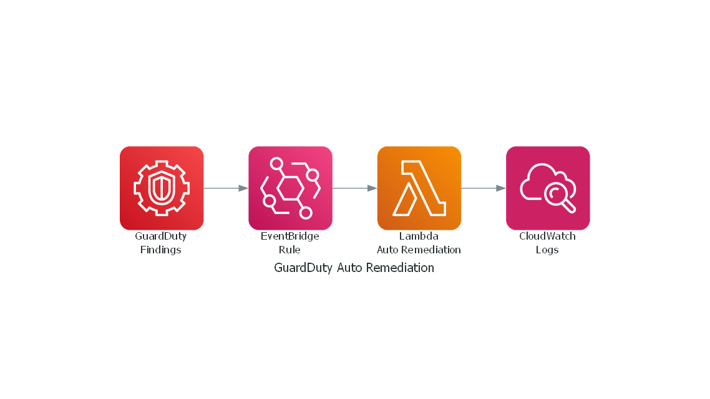
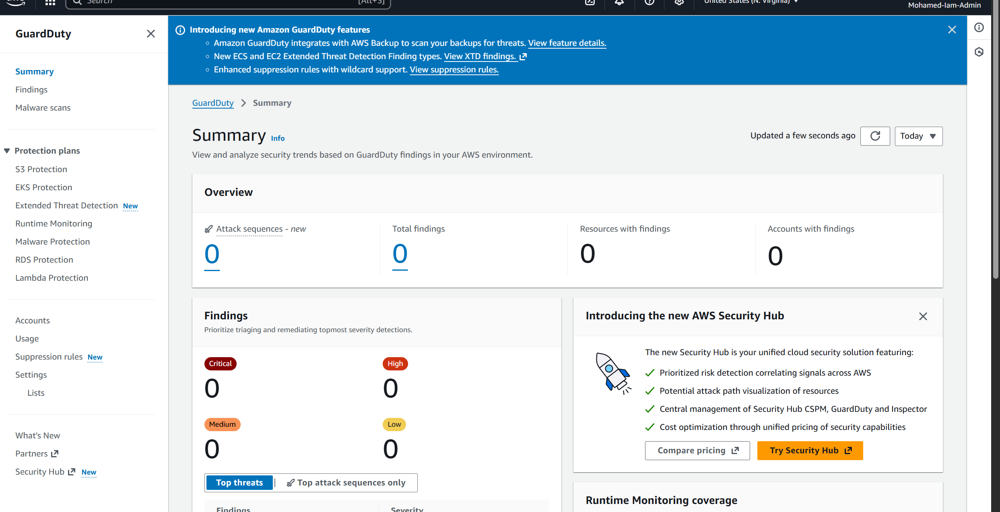
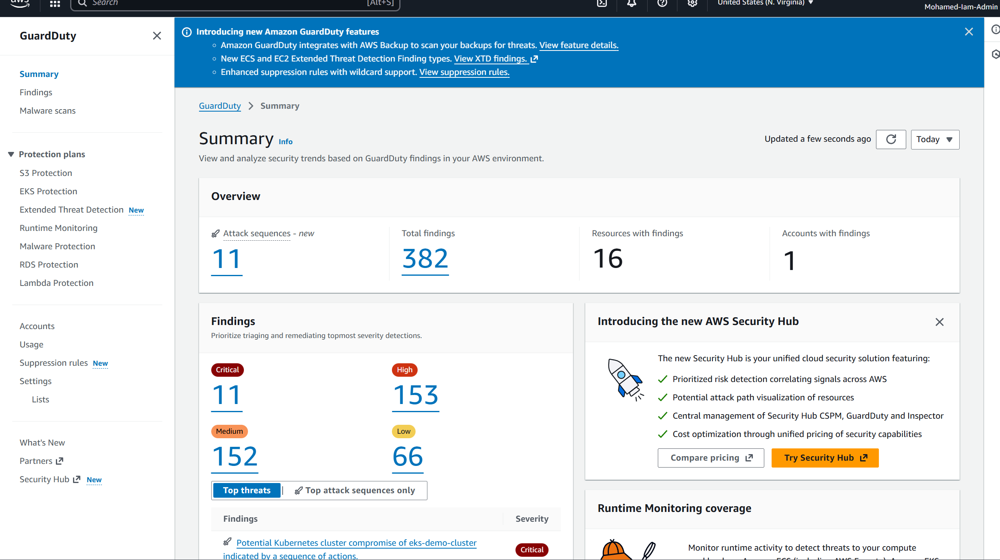
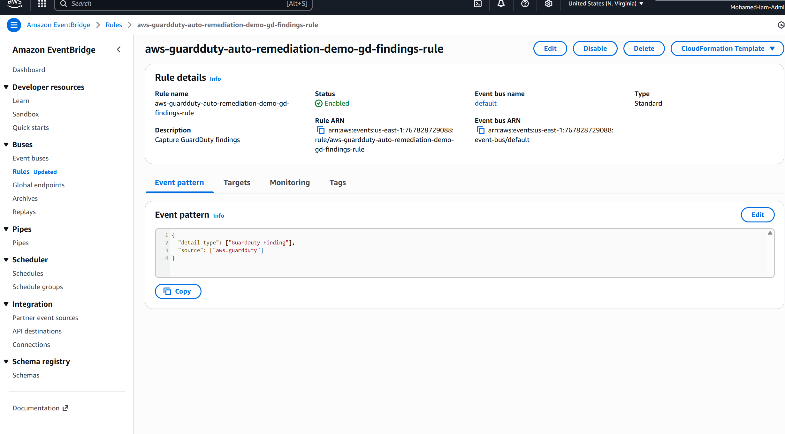
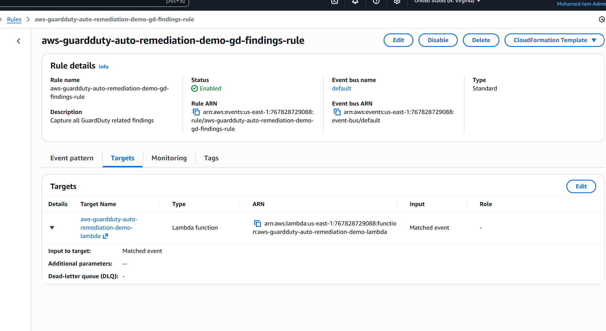
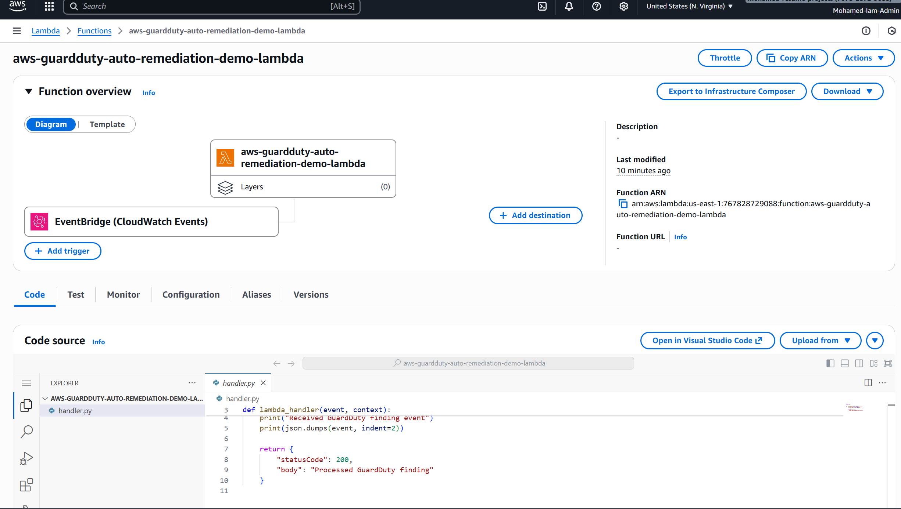
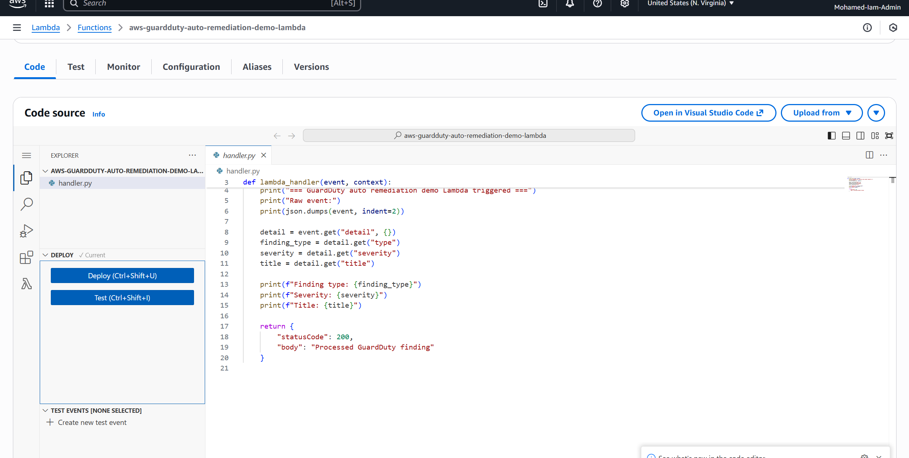
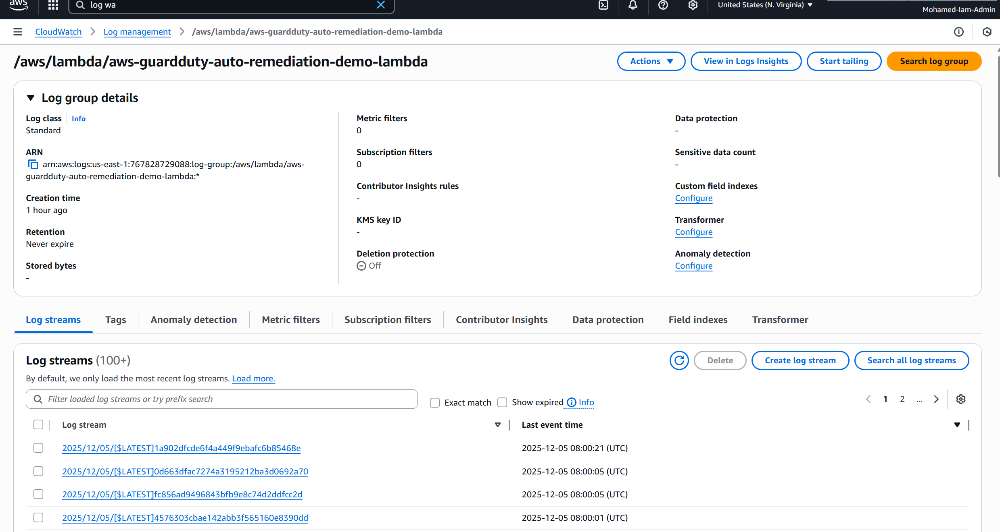
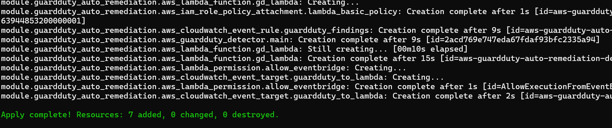

# AWS GuardDuty Auto Remediation Demo


Hands on cloud security project that shows how to detect threats in AWS using GuardDuty and automatically process the findings with serverless automation.

I built this as a small, low cost lab that up and coming cloud security/devsecops engineers can quickly understand and run.

---

## What this project does

- Enables **Amazon GuardDuty** in an AWS account using **Terraform**
- Exports GuardDuty findings to **Amazon EventBridge**
- Triggers an **AWS Lambda** function for every GuardDuty event
- Logs the full finding payload to **CloudWatch Logs**
- Parses useful fields such as finding type, severity, and title so it is easy to plug in real remediation later

This is a realistic pattern that many teams use in production as the first step toward automated threat response.

---

## Architecture

High level flow:

1. GuardDuty continuously analyzes AWS activity for suspicious or malicious behavior.
2. When a finding is created, GuardDuty publishes an event with `source = aws.guardduty`.
3. An EventBridge rule matches all events from `aws.guardduty` and forwards them to a Lambda function.
4. The Lambda function:
   - Prints the raw finding payload
   - Extracts key fields such as `type`, `severity`, and `title`
   - Writes everything to CloudWatch Logs
5. Security engineers can extend the Lambda to add real remediation such as blocking IPs, tagging resources, or notifying a security channel.

### Architecture diagram



---

## Tech stack

- **AWS services**: GuardDuty, EventBridge, Lambda, CloudWatch Logs, IAM  
- **IaC**: Terraform with a small reusable module  
- **Language**: Python 3.12 for the Lambda handler  

---

## Screenshots

Below are the key screenshots from the AWS GuardDuty Auto Remediation demo.

### GuardDuty enabled


### GuardDuty sample findings


### EventBridge rule creation


### EventBridge targets


### Lambda function overview


### Lambda code used in remediation


### CloudWatch logs from remediation


### Terraform apply success



---

## Repository structure

```text
aws-guardduty-auto-remediation-demo/
  lambda/
    handler.py          - Lambda function that processes GuardDuty findings
    lambda.zip          - Packaged code used by Terraform

  terraform/
    main.tf             - Root module that wires everything together
    provider.tf         - AWS provider configuration
    variables.tf        - Region and common tags
    outputs.tf          - Useful outputs (detector id, lambda name, rule arn)
    modules/
      guardduty_auto_remediation/
        main.tf         - GuardDuty, EventBridge rule, Lambda and IAM role
        variables.tf    - Module inputs (project name, tags)
        outputs.tf      - Module outputs


  Screenshots/
    guardduty_enabled.png
    guardduty_sample_findings.png
    eventbridge_rule.png
    eventbridge_targets.png
    lambda_overview.png
    lambda_code.png
    lambda_cloudwatch_logs.png
    terraform_apply_success.png
